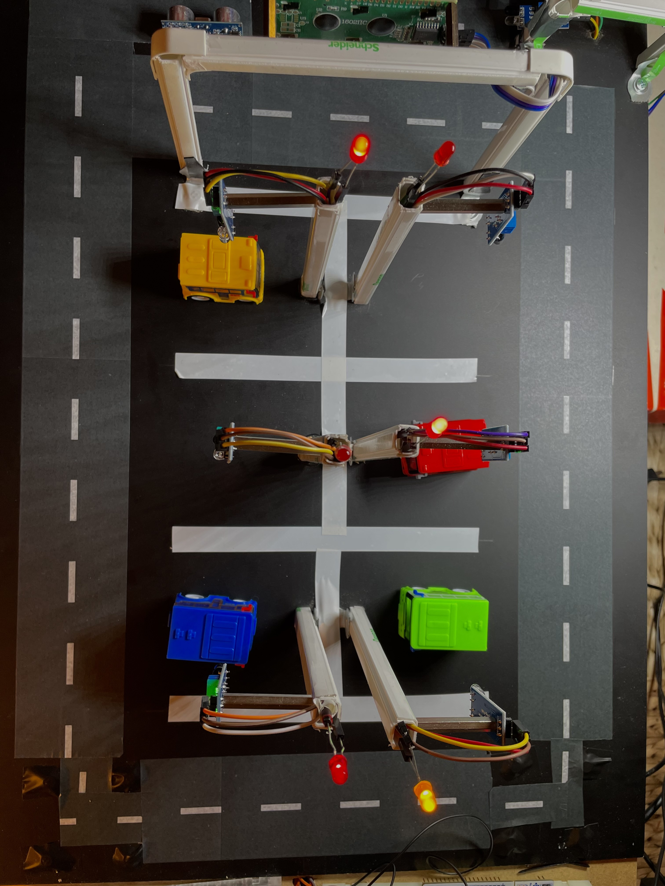
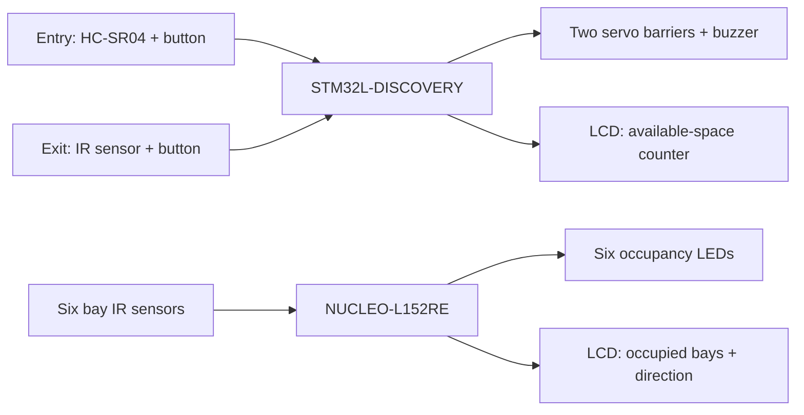
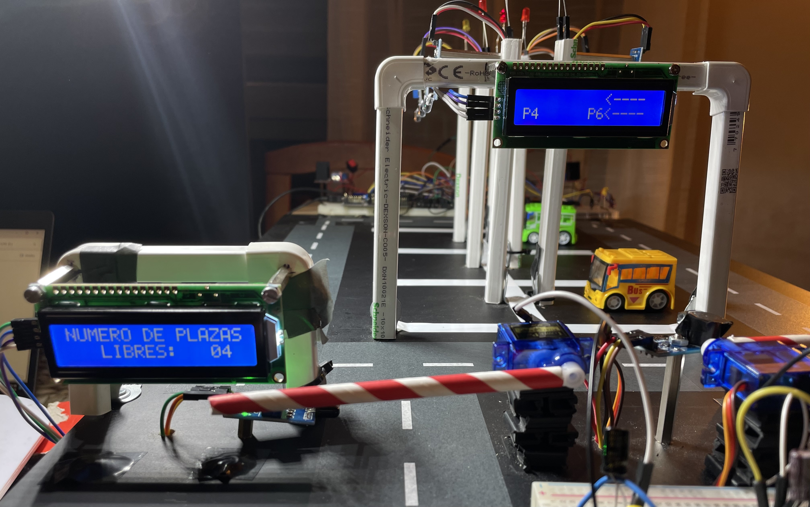
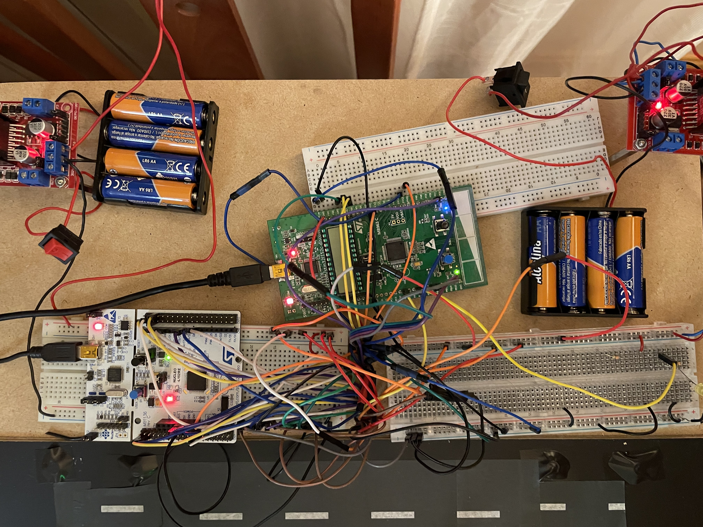

# Automated Parking System

**A six-space parking prototype built for my 2023–2024 bachelor thesis in Telecommunication Technologies Engineering.** Two STM32 boards control the entry/exit barriers, detect occupied bays, and guide drivers with LEDs and LCD displays.

<p align="center">
  
</p>
<p align="center"><em>The completed physical prototype — thesis figure 10.1.</em></p>

The thesis documents the mechanical construction, electronics, firmware, and functional demonstrations. This repository brings together the application sources and that project evidence.

**Build status:** the original Cube project and supporting drivers are not included, so a complete STM32 build cannot yet be reproduced from this repository.

## At a glance

| | Project |
| --- | --- |
| Controllers | STM32L-DISCOVERY (STM32L152RB) + NUCLEO-L152RE (STM32L152RE) |
| Firmware | C, STM32 HAL initialization, direct register configuration, interrupts and timers |
| Inputs | HC-SR04 entrance sensor, Flying Fish IR sensors, entry/exit buttons |
| Outputs | Two SG90 servo barriers, buzzer, six bay LEDs and two 16×2 I²C LCDs |
| Prototype | Six bays on a 60 × 40 cm upper deck; 80 × 40 cm lower base |
| Evidence | Original prototype photographs, pin maps, flowcharts and thesis-reported demonstrations |

## How it works



Discovery handles access and a button-driven available-space counter. Nucleo detects bay occupancy and points toward the less occupied side. The published applications maintain separate state; they do not implement a communication link between the boards.

<table>
  <tr>
    <td width="50%"></td>
    <td width="50%"></td>
  </tr>
  <tr>
    <td>Available-space counter and bay guidance — figure 10.4.</td>
    <td>Electronics and power arrangement — figure 10.3.</td>
  </tr>
</table>

## What the thesis demonstrates

Chapter 10 reports gate operation, entry/exit counting, occupancy LEDs, LCD guidance, and complete parking sequences under controlled prototype conditions. It also records an **RC input filter to address button bounce**, ambient-light sensitivity of the IR sensors, and mechanical/power limitations.

These are historical functional demonstrations. The thesis does not provide a quantitative accuracy, latency or reliability benchmark. See the [results and limitations](docs/results.md) for the evidence and its scope.

## Explore

| Documentation | Contents |
| --- | --- |
| [Prototype gallery](docs/gallery.md) | Finished model, barriers, displays and electronics |
| [Architecture](docs/architecture.md) | Responsibilities, interrupt-driven logic and original main-loop flowcharts |
| [Hardware](docs/hardware.md) | Exact boards, component roles, pin tables and original pin maps |
| [Results](docs/results.md) | Reported demonstrations, lessons and unresolved questions |
| [Development](docs/development.md) | Host checks and dependencies needed to recover a target build |
| [Technical review](docs/review.md) | Source review reconciled with the thesis |
| [Figure sources and rights](docs/assets/README.md) | Original figure/page references and attribution |

The application entry points are [Discovery main.c](firmware/discovery/main.c) and [Nucleo main.c](firmware/nucleo/main.c).

## Available checks

On Linux with Python 3 and GCC:

```bash
python3 tests/check_display_format.py
```

This checks the isolated Discovery LCD formatting helper. It does not compile the STM32 applications or test the hardware. C formatting uses clang-format 18.1.8; commands are in the [development guide](docs/development.md).

## Project history and attribution

**Author:** Adrián Ibeas Lara. **Thesis supervisor:** José Enrique Suárez Pascual.

**Thesis:** *Design of an Automated Vehicle Parking System Using a Microcontroller*, academic year 2023–2024.

The 2026 documentation update incorporates technical material and unchanged figures from the completed thesis. The original STMicroelectronics source notices and Cube `USER CODE` boundaries are preserved. An earlier maintenance change removed repeated heap allocation from the LCD helper.

The thesis cover states **Creative Commons Attribution – Non Commercial – Non Derivatives**, without specifying a version. That notice accompanies the [thesis figures](docs/assets/README.md). A repository-wide source-code license has not been selected.
