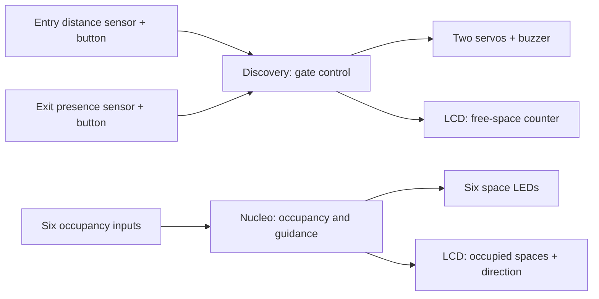

# Architecture

The source contains two independent firmware applications. This diagram describes responsibilities visible in the C files; it is not a wiring diagram.

## Discovery application

[Source](../firmware/discovery/main.c)

- TIM2 captures the ultrasonic echo and handles buzzer/trigger timing.
- TIM3 periodically schedules an ultrasonic trigger.
- TIM4 channels drive two servo outputs.
- External interrupts record the entry/exit button states and exit vehicle presence.
- Button press edges decrement/increment a counter initialized to six.
- The main loop selects servo positions and buzzer modes from distance and button state, and writes the counter to the LCD.

The counter is driven by button events. It is not synchronized with the Nucleo occupancy inputs.

## Nucleo application

[Source](../firmware/nucleo/main.c)

- External interrupts update six occupancy flags.
- The main loop maps those flags to individual LEDs and LCD labels P1–P6.
- The application compares occupied counts on the two sides and displays an arrow toward the less occupied side; equal counts produce a neutral indication.

## Boundaries

GPIO configuration mixes generated HAL initialization with direct register writes. Interrupt handlers share state with the main loops. The clock, driver, startup, and interrupt integration depend on files that were not included in the original publication.

See [technical review](review.md) for the issues that must be resolved before making reliability claims.
