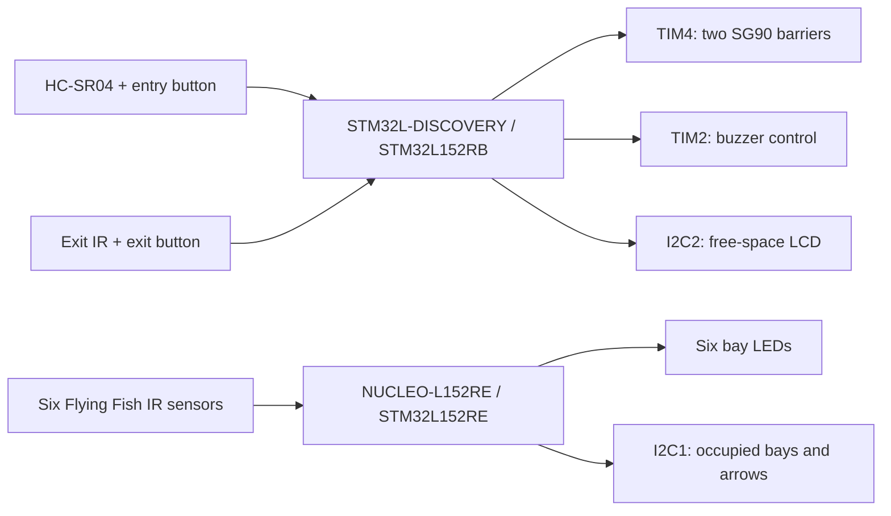
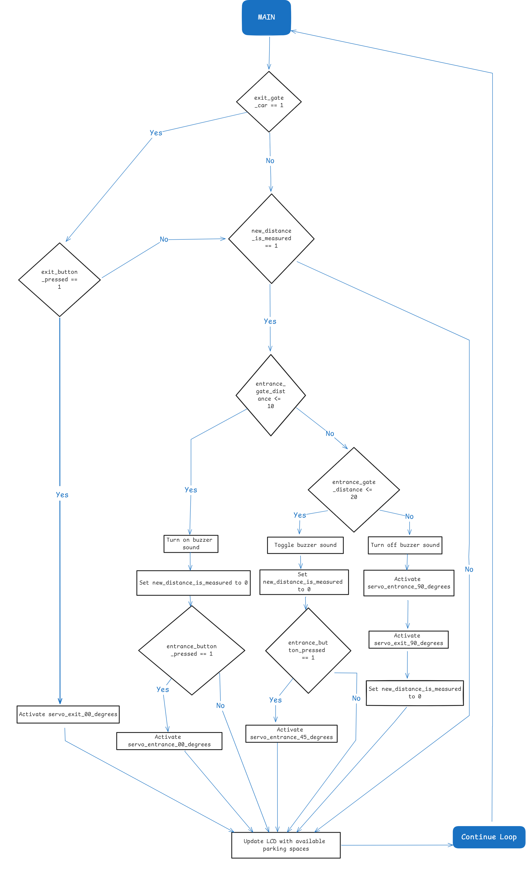
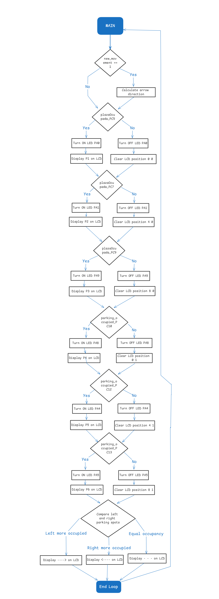

# Architecture

Two STM32 applications divide the prototype into access control and bay guidance. The overview below summarizes the source and thesis chapters 6–7; it describes functional responsibilities rather than complete electrical wiring.

## Discovery: access control

[Application source](../firmware/discovery/main.c)

- TIM2 captures the ultrasonic echo and handles buzzer/trigger timing.
- TIM3 periodically schedules an ultrasonic trigger.
- TIM4 channels 1 and 2 drive the exit and entry servo outputs.
- External interrupts record entry/exit button states and exit vehicle presence.
- Button press edges decrement/increment an available-space counter initialized to six.
- The main loop selects servo positions and buzzer modes from distance and button state, and writes the counter to the LCD.

The counter follows button events. It is not calculated from the Nucleo bay sensors. The thesis reports a physical RC filter on the button input to reduce repeated interrupts from bounce; the published handlers do not implement equivalent software filtering.

Original Discovery main-loop flowchart — thesis figure 7.7

Source: chapter 7, printed page 65 / PDF page 80. This is the historical design figure; use the published C file to resolve exact branch behavior.

## Nucleo: bay occupancy and guidance

[Application source](../firmware/nucleo/main.c)

- External interrupts update six occupancy flags.
- The main loop maps those flags to individual LEDs and LCD labels P1–P6.
- Occupied counts on the two sides determine the direction indicator; equal counts produce a neutral indication.

Original Nucleo main-loop flowchart — thesis figure 7.11

Source: chapter 7, printed page 73 / PDF page 88.

## Timer intent

The thesis calculations assume a **32 MHz timer input clock**. This table cross-checks that assumption against the register assignments in the Discovery source; the values are calculated design settings, not new oscilloscope measurements.

| Function | Source settings | Calculated intent |
| --- | --- | --- |
| Servo PWM / TIM4 | PSC = 639; ARR = 999 | 50 kHz timer ticks; 20 ms period / 50 Hz |
| Servo pulse widths | CCR = 50, 75, 100 | 1, 1.5, 2 ms; thesis labels these 0°, 45°, 90° |
| TIM2 time base | PSC = 31 | 1 µs per tick |
| Ultrasonic trigger | TIM2 compare scheduled 13 ticks later | 13 µs pulse |
| Trigger repetition / TIM3 | PSC = 31999; compare advanced by 300 | 300 ms interval |
| Buzzer compare | TIM2 CCR2 advanced by 64000 | 64 ms compare-event interval |

The source comment describing TIM4 as 100 Hz conflicts with the 50 Hz calculation. The buzzer comment describing 250 ms also conflicts with the 64 ms interval under the stated clock assumption. Verify the actual peripheral clock and output signals when the target project is recovered. Servo pulse-to-angle calibration also depends on the physical assembly.

## System boundaries

The two boards have independent state and no communication protocol in the published code. GPIO configuration mixes generated HAL initialization with direct register writes; interrupt handlers share state with the main loops.

The thesis provides historical implementation context and prototype demonstrations. It does not restore the missing clock/startup/driver integration files or establish that the maintained sources have been built and tested on hardware. See the [technical review](review.md), [hardware inventory](hardware.md), and [reported results](results.md).

[Figure attribution and rights](assets/README.md)
