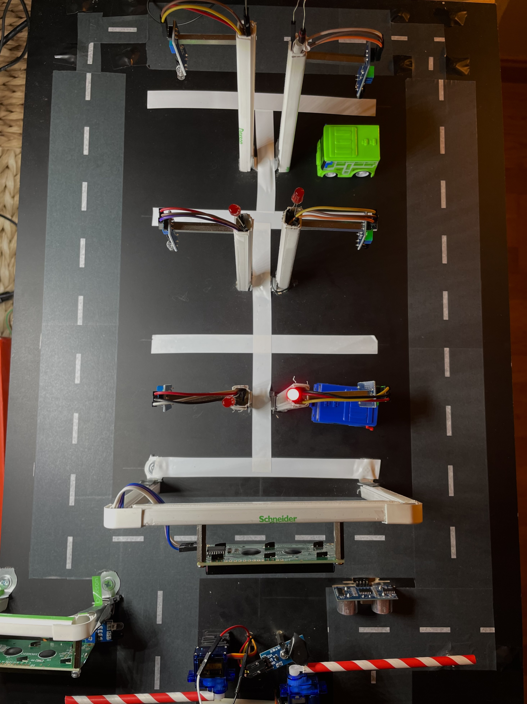
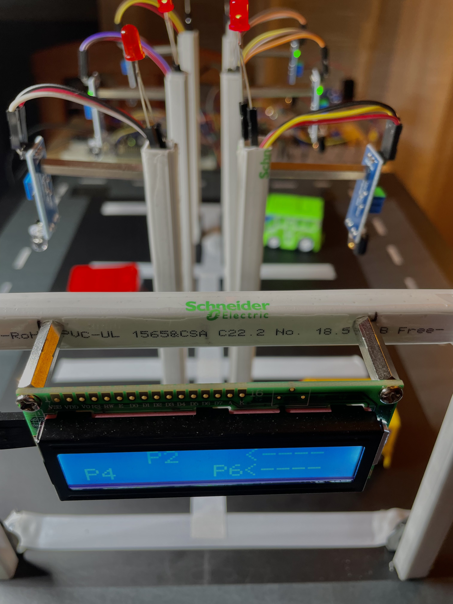

# Prototype gallery

Original photographs from chapter 10 of Adrián Ibeas Lara's 2023–2024 bachelor thesis. These show the historical completed model, rather than a newly rebuilt or retested system.

## Completed parking model

  

**Figure 10.1 — printed page 80 / PDF page 95.** Six bays, model vehicles and sensor/indicator assemblies.

## Barriers and bay arrangement

  

**Figure 10.2 — printed page 81 / PDF page 96.** The gate assemblies and physical layout.

## Electronics and power

**Figure 10.3 — printed page 81 / PDF page 96.** This photograph records the assembly but is not a substitute for an electrical schematic.

## Two displays, two responsibilities

**Figure 10.4 — printed page 83 / PDF page 98.** The entrance LCD shows available-space counting; the other display identifies occupied bays and gives direction guidance.

## Occupancy indicators

  

**Figure 10.6 — printed page 85 / PDF page 100.** Bay sensor posts, indicators and the guidance LCD.

See [hardware and original pin maps](hardware.md), [main-loop flowcharts](architecture.md), and [reported demonstrations](results.md).

[Figure attribution and rights](assets/README.md)
