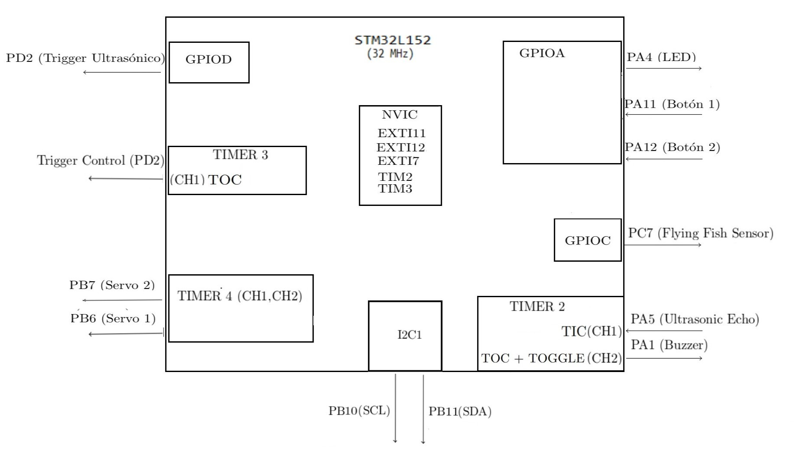
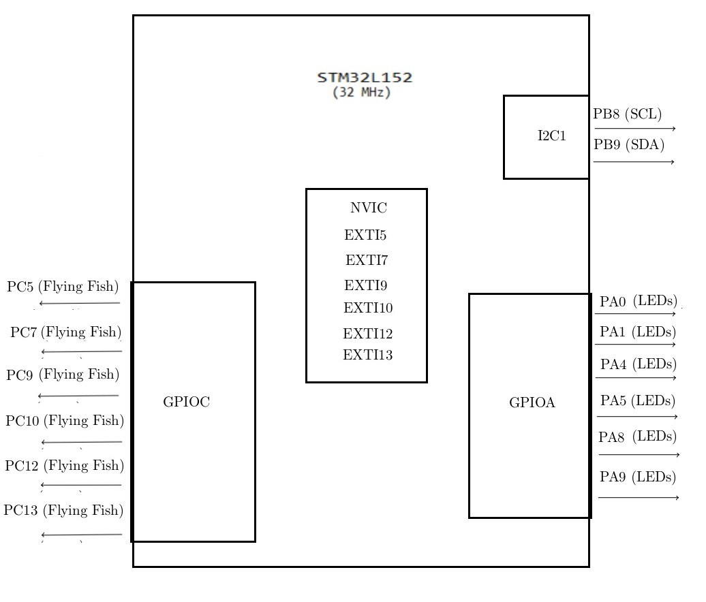

# Hardware and pin inventory

The completed thesis identifies the board variants and component roles. The tables below combine that design record with the published C files. They describe the prototype; a checked assembly schematic and the original Cube configuration are still needed to reproduce it.

## Boards and components

| Component | Role | Thesis reference |
| --- | --- | --- |
| STM32L-DISCOVERY / STM32L152RB | Access control, gate servos, proximity warning and available-space LCD | §3.2.2, chapter 7 |
| NUCLEO-L152RE / STM32L152RE | Six bay inputs, LEDs and directional LCD | §3.2.1, chapter 7 |
| HC-SR04 ultrasonic sensor | Vehicle distance at the entrance | §3.4, §7.3 |
| Flying Fish IR modules | Bay occupancy and exit vehicle presence | §3.4, §7.4 |
| Two SG90 servomotors | Entry and exit barriers | §3.4, §7.2 |
| MH-FMD buzzer | Entrance proximity warning | §3.4, §7.3 |
| Two external 16×2 I²C LCDs | Free-space count and bay/direction guidance | §3.4, §7.3–7.4 |
| L298N modules | Used in the prototype's power arrangement | §4.1 |
| Button input RC filter | Hardware mitigation for contact bounce | §10.2 |

The L298N modules are described as part of power distribution/regulation, rather than as drivers for DC traction motors. Chapter 10 discusses battery supply effects on barrier movement. Supply rails, grounding, protection and sensor/MCU voltage compatibility require an independently checked wiring record.

## Mechanical model

Chapter 4 documents a six-space upper parking deck measuring **60 × 40 cm**, above an **80 × 40 cm** lower base. The extra 20 cm section accommodates electronics and power components. Sensor posts, LED indicators and servo barriers are mounted on the model.

See the [original prototype photographs](gallery.md).

## Discovery connections

| Function | Pin / peripheral | Evidence |
| --- | --- | --- |
| Entry button | PA11 / EXTI11 | Source + chapter 7 |
| Exit button | PA12 / EXTI12 | Source + chapter 7 |
| Exit presence | PC7 / EXTI7 | Source + chapter 7 |
| Ultrasonic trigger | PD2 | Source + figure 7.1 |
| Ultrasonic echo | PA5 / TIM2 CH1 | Source + figure 7.1 |
| Exit servo | PB6 / TIM4 CH1 | Source |
| Entry servo | PB7 / TIM4 CH2 | Source |
| Buzzer | PA1 / TIM2 CH2 | Source + figure 7.1 |
| Indicator LED | PA4 | Source + figure 7.1 |
| LCD clock / data | PB10 SCL / PB11 SDA, I2C2 | Thesis printed pages 62–63; source uses I2C2 |

*Figure 7.1 — printed page 51 / PDF page 66.*

The original figure labels the LCD block **I2C1**. The detailed LCD subsection and the published Discovery source identify **I2C2**, used in the table above. The figure is reproduced unchanged.

The source also configures PC6 in its ultrasonic section, although trigger interrupts write to PD2. Recover the original Cube configuration and check the wiring before treating these assignments as a complete connection specification.

## Nucleo connections

| Bay | IR occupancy input | LED output |
| --- | --- | --- |
| P1 | PC5 | PA0 |
| P2 | PC7 | PA1 |
| P3 | PC9 | PA9 |
| P4 | PC10 | PA8 |
| P5 | PC12 | PA4 |
| P6 | PC13 | PA5 |

The handlers interpret low inputs as occupied and high inputs as available. The guidance LCD uses **I2C1: PB8 SCL / PB9 SDA**, documented in §7.4.3, printed page 71 / PDF page 86.

*Figure 7.8 — printed page 66 / PDF page 81. The per-bay pairing in the table comes from the source.*

## Electrical drawing gap

In the supplied PDF, figures **6.1 and 6.2** are filename placeholders inside empty frames, rather than embedded electrical schematics. The chapter 7 pin maps above are available, but they do not show a complete power/ground network, component values, connectors or input conditioning.

The thesis reports an RC button filter, but does not specify its R/C values in the supplied text. These values and the original chapter 6 drawing files are useful recovery targets.

## Needed for physical reproduction

1. Original Cube settings and full target project for each identified board.
2. Checked wiring, power rails and RC filter values.
3. LCD driver implementation, address and backpack configuration.
4. Fresh bench checks of detection, timing, counter behavior and gate clearance.

[Figure attribution and rights](assets/README.md)
